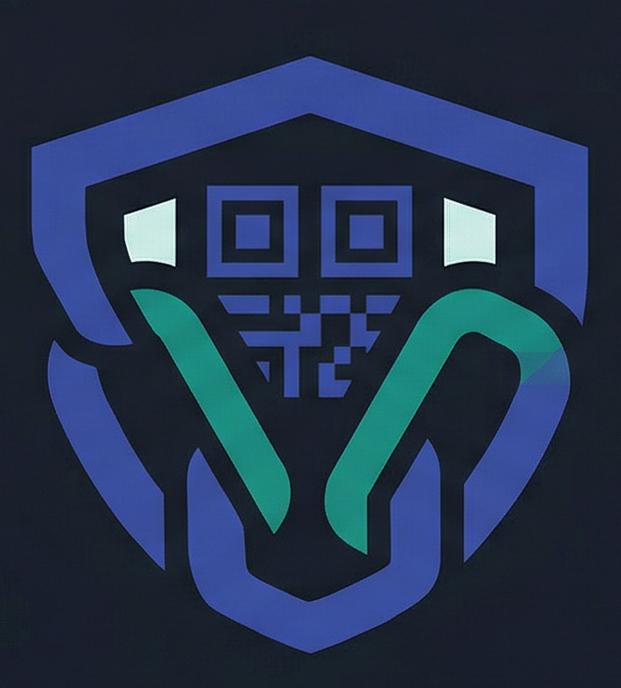
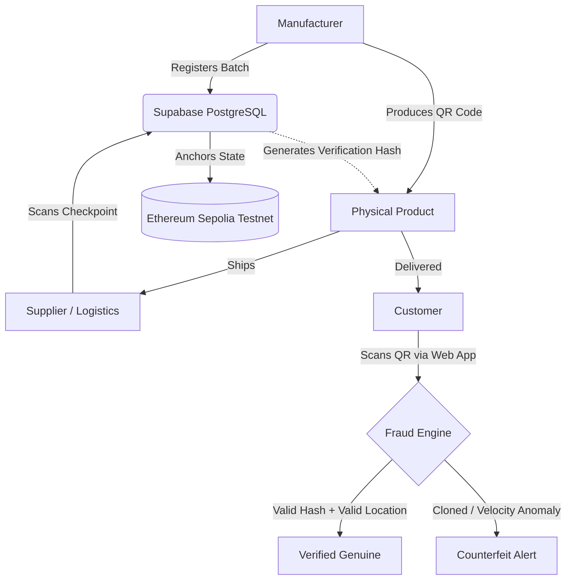

<div align="center">
  
  
  # AuthentiChain
  
  **Next-Generation Supply Chain Integrity & Anti-Counterfeiting Platform**

  [](https://reactjs.org/)
  [](https://vitejs.dev/)
  [](https://tailwindcss.com/)
  [](https://supabase.com/)
  [](https://soliditylang.org/)
  [](https://book.getfoundry.sh/)
</div>

---

## 📖 About The Project

AuthentiChain bridges the gap between physical products and immutable digital trust. In an era where supply chain tampering and counterfeit products pose critical threats to consumer safety and brand reputation, AuthentiChain provides a cryptographic, decentralized, and verifiable ledger of a product's entire physical journey.

By utilizing strict state transitions, SHA-256 data anchors, hardware-accelerated QR verification, and Ethereum blockchain records, the system ensures that every product scanned is guaranteed genuine—or instantly flagged for fraud.

---

## 🛠 Flow Architecture



---

## ✨ Key Features

### 🔐 Cryptographic Hash Chain
Every logistical event (e.g., manufacturing, shipping, delivery) is cryptographically bound to the previous event using a strict hashing algorithm. 
- `hash = SHA-256(product_id + event_type + actor_id + timestamp + previous_hash)`
- **Tamper Evidence:** Modifying any historical database row invalidates the sequence, immediately flagging the entire product chain.

### 🛑 Automated Fraud Engine
Secured directly at the database level via Postgres RPC, the security matrix detects:
- **Velocity Clones:** Flags products scanned at abnormally high volumes or speeds.
- **Geographic Deviations:** Verifies physical GPS bounds for logical discrepancies between logistical checkpoints.
- **State Violations:** Ensures products cannot bypass crucial physical locations (e.g., jumping from `manufactured` directly to `delivered`).

### 📱 Hardware-Accelerated Scanner
Provides seamless, 30-frames-per-second native QR parsing natively in-browser via the BarcodeDetector API. Designed for high-speed warehouse scanning and instantaneous consumer checks.

### 🌐 Ethereum Smart Contract Anchoring
Significant shipment batches are cryptographically anchored to a public Ethereum smart contract (`ProductTracker.sol` via Foundry), offering third-party, decentralized verification independent of internal servers.

---

## 💻 Tech Stack

| Domain | Technologies |
| --- | --- |
| **Frontend Framework** | React 18, Vite, TypeScript |
| **Styling & UI** | Tailwind CSS, Framer Motion, Radix UI |
| **Backend & Auth** | Supabase (PostgreSQL), Supabase Auth |
| **Security & Logic** | Postgres RPC, Row Level Security (RLS) |
| **Web3 / Blockchain** | Foundry, Solidity, Sepolia Testnet |
| **QR Implementation** | `html5-qrcode`, Native Barcode API |

---

## 📁 Project Structure

```text
apas/
├── blockchain/                # Foundry smart contracts for Ethereum logic
│   └── product-auth-chain/    # Solidity project (ProductTracker.sol)
├── public/                    # Static assets (apas.png logo)
├── src/
│   ├── components/
│   │   ├── layout/            # Dashboards, Navbars, Footers
│   │   └── ui/                # Core customized UI blocks (FlowButton, Parallax)
│   ├── contexts/              # Global React Contexts (AuthContext)
│   ├── integrations/
│   │   └── supabase/          # Generated database types and DB client
│   ├── lib/                   # Utility scripts (hash generators, class combiners)
│   ├── pages/                 # Full screen route components (Auth, Verify, Dashboard...)
│   └── App.tsx                # Main Router mapping
├── supabase/                  # Local and remote automated secure DB management
│   ├── config.toml            # Env settings
│   └── migrations/            # Version-controlled SQL table/trigger/RPC schemas
└── tailwind.config.ts         # 'Cosmic Dark' theme extensions
```

---

## 👥 Role-Based Access Control (RBAC)

AuthentiChain ensures strict compartmentalization of data and permissions:

1. **Manufacturer Accounts:** Can mint product batches, register new physical goods, and initiate product recalls.
2. **Supplier Accounts:** Restricted explicitly to scanning logistical checkpoints (e.g., updating states to `In Transit` or `Arrived`).
3. **Consumer Verification:** Fully public, sign-in independent portal allowing any end-user to scan a QR code and verify provenance.
4. **Platform Administrator:** Maintains global oversight, dispute resolution, and audit-log monitoring.

---

## 🚀 Quick Start Guide

Follow these steps to deploy AuthentiChain locally for development.

### 1. Prerequisites
- **Node.js** (v18.0.0 or higher)
- **Supabase CLI** (for local databasing & manual pushes)
- **Foundry** (if working on the `/blockchain` Ethereum module)

### 2. Clone and Install
```bash
git clone https://github.com/your-org/apas.git
cd apas
npm install
```

### 3. Environment Variables
Create a root `.env` file and supply your Supabase credentials:
```env
VITE_SUPABASE_URL=your_project_url
VITE_SUPABASE_ANON_KEY=your_anon_key
```

### 4. Database Setup
Push the strict SQL schema, RPC logic, and Trigger functions to your Supabase project:
```bash
# Push schema migrations
supabase db push
```

### 5. Launch Development Server
```bash
npm run dev
```
The client will securely initialize at `http://localhost:8080`.

---

## 🎨 UI/UX Philosophy: "Cosmic Dark"

AuthentiChain breaks away from standard, dry enterprise management software. Our proprietary **Cosmic Dark** design system utilizes a custom `FlowButton` architecture powered by cubic-bezier CSS expansion physics, providing users with a hyper-responsive, fluid, and premium operational experience while they manage global logistics.

---

## 📄 License & Acknowledgments

This project is proprietary software built for modern supply chain infrastructure.
All cryptographic validations are processed via standardized `SHA-256` techniques, and Web3 anchoring relies on the Ethereum foundation's operational network. 

---
<div align="center">
  <i>AuthentiChain — Built for scale. Secured by mathematics.</i>
</div>