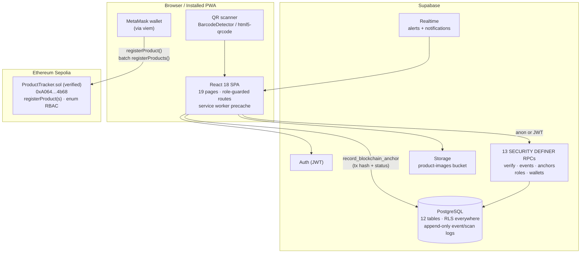

<div align="center">
  

  # AuthentiChain

  **Cryptographic product identities, QR-based consumer verification, and supply-chain fraud detection — with optional on-chain anchoring on Ethereum Sepolia.**

  [](https://react.dev/)
  [](https://www.typescriptlang.org/)
  [](https://vite.dev/)
  [](https://supabase.com/)
  [](https://sepolia.etherscan.io/address/0xA06470E128275c5fE4410d4A712F23d54c714b68)
  [](https://developer.mozilla.org/docs/Web/Progressive_web_apps)
  [](#running-tests)
  [](LICENSE)

  **[Operator Runbook](MANUAL_STEPS.md)** · **[System Design](#architecture)** · **[Security Model](#security--trust-model)** · **[RPC Reference](#routes--rpc-reference)**
</div>

> Screenshots are being captured and will be added here — every claim in this README is backed by the code in this repository.

---

## Table of Contents

- [About](#about)
- [The Problem](#the-problem)
- [The Solution](#the-solution)
- [Why AuthentiChain](#why-authentichain)
- [Who It Is For](#who-it-is-for)
- [Features](#features)
- [How It Works](#how-it-works)
- [Architecture](#architecture)
- [Security & Trust Model](#security--trust-model)
- [Cryptographic & Verification Model](#cryptographic--verification-model)
- [Tech Stack](#tech-stack)
- [Getting Started](#getting-started)
  - [Prerequisites](#prerequisites)
  - [Installation](#installation)
  - [Database & Backend Setup](#database--backend-setup)
  - [Environment Variables](#environment-variables)
- [Run It](#run-it)
- [Usage](#usage)
- [Routes & RPC Reference](#routes--rpc-reference)
- [Running Tests](#running-tests)
- [Project Structure](#project-structure)
- [Current Status](#current-status)
- [Known Limitations & Blockers](#known-limitations--blockers)
- [Roadmap](#roadmap)
- [Contributing](#contributing)
- [License](#license)
- [Acknowledgements](#acknowledgements)
- [Contact](#contact)

---

## About

AuthentiChain is a **B2B + B2C supply-chain integrity platform**. Manufacturers give every physical product a cryptographic identity; suppliers record each checkpoint as the product moves through the chain; and any consumer can scan a QR code with their phone camera — no app download, no account — to instantly see whether a product is **genuine, recalled, expired, or flagged as a suspected counterfeit**.

Every event is bound into a tamper-evident SHA-256 hash chain computed **inside the database** (never in the browser), every access rule is enforced by Postgres Row Level Security, and critical records can be anchored to Ethereum Sepolia via the source-verified `ProductTracker.sol` contract for proof that doesn't depend on this platform's own servers.

The frontend can be fully compromised without letting an attacker forge history, self-assign roles, poison fraud counters, or fake an on-chain proof — that boundary is the point of the architecture.

## The Problem

- Consumers have **no reliable way to verify authenticity at the point of purchase**. Counterfeit goods cost brands and consumers billions every year.
- Existing anti-counterfeiting tech is either expensive and proprietary (RFID/NFC) or too centralized to be trusted by the parties it's supposed to protect.
- Supply-chain tampering usually goes undetected until the damage is done — there's no immutable record of *who handled a product, where, and when*.
- Naive "scan counter" verification systems are trivially gamed: repeated scans false-flag legitimate buyers, and attackers can fabricate scans to drain trust scores or force counterfeit verdicts.

## The Solution

A web platform that:

1. **Registers products** with auto-generated codes (`PRD-XXXXXXXX`), SHA-256 verification hashes, and printable QR labels encoding a live verification URL.
2. **Tracks every supply-chain event** (`shipped → in transit → received → delivered → sold`) in an append-only, hash-chained ledger with server-enforced state transitions and custody checks.
3. **Verifies authenticity instantly** via in-browser QR scanning against a hardened server-side engine: clone detection, geo-velocity analysis, rate limiting, and hash-chain integrity in one atomic call.
4. **Detects fraud automatically** and raises real-time alerts to manufacturers and admins — with anti-griefing rules so detection can't be weaponized.
5. **Anchors records to Ethereum Sepolia** through a MetaMask wallet flow, showing Etherscan proof only after real on-chain confirmation.

## Why AuthentiChain

| | Typical "verification" apps | AuthentiChain |
|---|---|---|
| Consumer setup | App download, account required | **Point camera at QR — that's it** (public `/verify`) |
| Integrity | Central database, editable rows | **Append-only SHA-256 hash chain**, computed server-side |
| Access control | Client-side role checks | **Postgres RLS + SECURITY DEFINER RPCs** — roles cannot be self-assigned |
| Product state | Direct UPDATEs | Clients hold **no UPDATE grant at all** — state changes are RPC-only |
| Fraud detection | Manual review | Automated: distinct-device clone detection, impossible travel, invalid sequences, rapid-scan bursts, rate limiting |
| Ownership | Optimistic UI | Custody-validated RPC that locks the product row and sets the owner atomically |
| Independent proof | None | Optional Sepolia anchoring; Etherscan links appear **only when confirmed** |
| Honesty policy | Shows "verified" regardless | Never fakes it: pending/failed TX states, offline scans queued — never a fabricated verdict |

## Who It Is For

| Role | Who | What they do |
|---|---|---|
| **Manufacturer** | Pharma, electronics, luxury, food brands | Register products/batches, import CSVs, generate QRs, recall products, anchor on-chain, monitor alerts |
| **Supplier / Distributor** | Logistics, warehouses, retailers | Scan checkpoints with GPS, record custody events, track shipments on a map |
| **Consumer** | End buyers | Scan a QR before purchase — no account, no app, instant verdict |
| **Admin / Auditor** | Platform operators, regulators | Resolve fraud alerts, manage roles, audit logs, system analytics |

Roles are assigned only by a server-side trigger on signup (with a strict whitelist — `admin` is never signup-settable) or by an admin-only RPC with last-admin protection.

## Features

**Verification & anti-counterfeiting**
- **Browser QR scanning** — native `BarcodeDetector` where available, `html5-qrcode` canvas fallback, manual code entry as a third path.
- **Server-side verification engine** (`verify_product_secure` RPC) — status check, rate limiting, distinct-device clone detection, impossible-travel, hash-chain integrity; returns the full journey timeline with the verdict.
- **Eight honest result states** — genuine, counterfeit, chain tampered, not found, recalled, expired, suspended, rate-limited — each with its own screen.
- **Trust score (0–100)** per product — decremented only when *new* alerts fire (griefing-resistant), restored by legitimate scans.
- **PDF certificates of authenticity** (jsPDF) and print-ready verification results.

**Supply-chain operations**
- **Product & batch management** — registration with images, categories, dates, CSV bulk import with summary, recall flow with automatic server-side alerts, batch detail with product breakdown.
- **Supplier checkpoint scanner** — scan-or-type codes, GPS auto-detect, server-validated state transitions with custody enforcement.
- **Ownership transfer** — custody-validated RPC with full transfer history (immediate-completed semantics).
- **Supply-chain map** — Leaflet visualization of the journey with route lines.

**Trust & oversight**
- **Real-time fraud alert feed** (Supabase Realtime), severity badges, filters, pagination, admin resolution with automatic product unflagging.
- **Analytics dashboard** — products-over-time, scans-per-day, category breakdown, fraud trends, date ranges, CSV export, nightly rollup table.
- **Audit logs** — append-only event history with search and pagination.
- **User management** — admin role changes via guarded RPC, search, role filter, pagination.
- **In-app notifications** — unread badge, realtime delivery, mark-as-read/clear.

**Platform**
- **Installable PWA** — offline QR *decode only* ("Scanned — will verify once online"); the app never shows a genuine/fake verdict without a live server round-trip.
- **Bilingual UI** — English and Hindi (i18next).
- **Wallet integration** — MetaMask connect, wrong-network switch/add handling, gas estimation before signing, faucet guidance on insufficient funds, batch anchoring in a single transaction.
- **Dark "Cosmic Dark" design system** throughout, responsive to 375 px.

## How It Works

### The core journey

```
Manufacturer                Supplier                      Consumer
────────────                ────────                      ────────
Register product      →     Scan at each checkpoint   →   Scan QR with phone
(code + SHA-256 hash)       (shipped → in transit →       →  /verify?code=PRD-…
Print QR labels             received → delivered)            Server-side verdict:
Anchor hash on-chain        Server validates every event     genuine / fake / recalled /
                            (state + custody + hash)         expired + trust score
```

### What happens during a verification (`/verify`)

1. **Input sanitation** — malformed or out-of-range GPS from the client is ignored, never trusted.
2. **Status check** — recalled/expired/suspended products return immediately; a recalled product can never report as genuine.
3. **Rate limit** — max 10 verifications per minute per server-computed device fingerprint; abusers get an explicit `RATE_LIMITED` verdict.
4. **Lookup** — by product code, secure token, or QR data.
5. **Clone check** — counts **distinct device fingerprints** (same-device re-scans never false-flag); ≥10 distinct devices on one unit is the clone signal; accepted ownership-transfer recipients are exempt.
6. **Geo check** — impossible travel between consecutive scans (>500 km/h, haversine).
7. **Hash-chain check** — verifies the event chain hasn't been broken or reordered.
8. **All good** — scan logged, product claimed, trust score incremented, journey timeline returned with the verdict.

## Architecture


```mermaid
flowchart TB
    subgraph Client["Browser / Installed PWA"]
        UI["React 18 SPA<br/>19 pages · role-guarded routes<br/>service worker precache"]
        QR["QR scanner<br/>BarcodeDetector / html5-qrcode"]
        WALLET["MetaMask wallet<br/>(via viem)"]
    end

    subgraph Supabase["Supabase"]
        AUTH["Auth (JWT)"]
        PG[("PostgreSQL<br/>12 tables · RLS everywhere<br/>append-only event/scan logs")]
        RPC["13 SECURITY DEFINER RPCs<br/>verify · events · anchors<br/>roles · wallets"]
        RT["Realtime<br/>alerts + notifications"]
        STORE["Storage<br/>product-images bucket"]
    end

    subgraph Chain["Ethereum Sepolia"]
        SC["ProductTracker.sol (verified)<br/>0xA064…4b68<br/>registerProduct(s) · enum RBAC"]
    end

    UI -->|"anon or JWT"| RPC
    UI --> AUTH
    QR --> UI
    RPC --> PG
    RT --> UI
    UI --> STORE
    WALLET -->|"registerProduct()<br/>batch registerProducts()"| SC
    UI -->|"record_blockchain_anchor<br/>(tx hash + status)"| PG
```

**What stays off-chain vs on-chain:** the entire registry, event history, fraud logic, custody, and trust scoring live off-chain in Postgres — fast, private, and queryable. Only the product ID + verification hash pair is anchored on-chain, as independent proof that survives even a total compromise of the platform database.

**Key architectural decisions**

- **The database is the API.** The frontend talks to Postgres through RLS-gated queries and SECURITY DEFINER RPCs — there is no custom server to deploy or secure separately.
- **Hash chains are computed inside** `record_supply_chain_event()`; clients never supply hashes, so history cannot be forged even by an authenticated user holding a valid JWT.
- **Append-only by policy:** `supply_chain_events` and `scan_logs` have no client INSERT and no UPDATE/DELETE policies at all — direct inserts can't poison fraud counters, and nothing can silently edit history.
- **RPC-only protected state:** recall, anchoring, flag resolution, claims, and trust changes happen inside definer functions; clients hold no UPDATE grant on `products`.
- **PWA precache (~69 entries ≈ 3 MB)** for installable offline shell use — but verification always requires the live RPC.

## Security & Trust Model

**Implemented controls**

- **Server-side RBAC.** Roles come only from the `handle_new_user()` trigger (whitelisted signup metadata; anything else defaults to `customer`; `admin` never settable at signup) or the admin-only `admin_change_role()` RPC, which rejects self-demotion and protects the last remaining admin. A `UNIQUE(user_id)` index enforces exactly one role per user.
- **Row Level Security everywhere.** All 12 tables have RLS with explicit policies using the `has_role()` definer helper — never client state. Anonymous visitors read no tables directly; verification is the RPC.
- **No direct writes to protected state.** `REVOKE UPDATE ON products FROM authenticated/anon/public`, plus a column-scoped SELECT grant that excludes the secret `secure_token`. Transfers, events, scan logs, alerts, and notifications-insert are equally RPC-only.
- **Immutable records.** No UPDATE/DELETE policies exist on append-only tables — not even for admins.
- **SECURITY DEFINER hygiene.** Every definer function pins `SET search_path = ''` with fully qualified references; in-RPC hashing uses Postgres' built-in `sha256()` so correctness doesn't depend on extension schema resolution.
- **Fraud safeguards.** Device fingerprints computed server-side (IP + UA + uid); GPS sanitized; deductions fire only on genuinely new alerts; same-device re-scans exempt from clone/rapid rules; accepted-transfer recipients exempt from clone flags.
- **Rate limiting.** 10 verifications/minute/device fingerprint inside the RPC, returning an explicit verdict rather than silent throttling.
- **No secrets in the client.** Only the Supabase URL and anon key ship to the browser (safe by design). Transactions are signed by the user's own wallet; service-role keys never touch frontend code.
- **Honest-state policy.** A transaction can be marked `confirmed`/`failed` only after its exact hash was first recorded as `pending`; confirmed anchors are immutable; Etherscan links render only for confirmed TXs.
- **Input validation both sides** (Zod/React Hook Form client-side; CHECK constraints + RPC validation server-side), route-level error boundaries, DEV-gated logging.

**Verification still requiring live infrastructure** *(implemented in migrations, not yet exercised against a running database)*

- Re-running the corrected `v6_notifications.sql`, `v8_automation.sql`, and `v10_security_remediation.sql` on the live project, then testing: RBAC self-assignment denial, direct product-UPDATE denial, scan-log/transfer INSERT denial, rate-limit firing, distinct-device clone thresholds, concurrent genesis/transfer serialization, pg_cron execution, and the post-fix auto-expiry notification insert.

**Documented residual boundaries** *(by design, tracked — see [Known Limitations](#known-limitations--blockers))*

- On-chain `confirmed` is manufacturer-asserted under strict transition rules; no server component reads the Sepolia receipt yet.
- Wallet-signature verification happens client-side (viem); the nonce challenge is server-enforced, but no authorization currently gates on the wallet mapping, which keeps the gap inert.
- `device_hash` degrades to UA+uid when the client IP is unavailable behind connection pooling.

## Cryptographic & Verification Model

```
product_hash   = SHA-256(product_code | name | brand | manufacturer_id | timestamp)

event_hash[0]  = SHA-256(product_id | event_type | actor_id | timestamp | "genesis")
event_hash[n]  = SHA-256(product_id | event_type | actor_id | timestamp | event_hash[n-1])
                 (computed SERVER-SIDE; previous hash fetched under SELECT … FOR UPDATE
                  to serialize concurrent inserts and prevent chain forking)

transfer_hash  = SHA-256(product_id | from_user_id | to_user_id | timestamp)   -- server-side

QR payload     = https://<app>/verify?code=PRD-XXXXXXXX
QR data column = PRD-XXXXXXXX::<16-char hash prefix>
```

- **Client-submitted hashes are discarded** by every RPC — client-side event/transfer hashing helpers were removed from the codebase entirely (they'd be forgeable: no server secret, all fields knowable).
- Each event links to the previous one; a partial UNIQUE index on `previous_event_hash` makes chain forks physically impossible.
- Tamper attempts surface as a `TAMPERED` consumer verdict, a flagged product, and a −50 trust deduction.
- **Trust score:** starts at 100; fraud deductions (see below), genuine scans restore +10 (cap 100); displayed as high (≥80) / medium (≥50) / low (<50).

**Fraud rules (final values, enforced server-side)**

| Detection | Trigger | Action | Severity |
|---|---|---|---|
| Clone / suspected clone | ≥10 **distinct** devices scanned one product (transfer recipients exempt) | Flag + alert; −10 trust | Critical |
| Impossible travel | >500 km/h between GPS-tagged scans | Alert; −20 trust | High |
| Rapid scans | ≥5 distinct devices within 5 min | Alert; −10 trust | Medium |
| Invalid sequence | Event violates the lifecycle state machine | RPC rejected + flag + alert | High |
| Hash-chain tamper | Recomputed linkage mismatch | `TAMPERED` verdict + flag; −50 trust | Critical |
| Rate-limit abuse | >10 verifies/min/device fingerprint | `RATE_LIMITED` verdict | — |
| Manual flag | Recall flow (server-side) | Alert + flagged product | High |

**Lifecycle state machine:** `manufactured → shipped → in_transit → received → delivered → sold`, with `received → shipped` re-ship, `ANY → recalled` (manufacturer, via RPC with included alert) and `ANY → expired` (nightly pg_cron job acting as a dedicated system actor). Invalid transitions are rejected **and recorded**.

## Tech Stack

| Layer | Technology |
|---|---|
| Frontend | React 18.3 · TypeScript 5.8 · Vite 8.2 (rolldown) · Tailwind CSS 3.4 · Radix/shadcn UI · Framer Motion 11 |
| Routing & state | React Router 7.18 · TanStack React Query 5.83 |
| Backend | Supabase — Auth (JWT), PostgreSQL, RLS, 13 SECURITY DEFINER RPCs, Realtime, Storage, pg_cron |
| Cryptography | SHA-256 via `@noble/hashes` 2.3 (audited, zero-dependency) |
| Blockchain | viem 2.55 · `ProductTracker.sol` (Solidity ^0.8.24, Foundry) · Ethereum Sepolia |
| QR | `qrcode.react` (generation) · `html5-qrcode` + BarcodeDetector (scanning) |
| Media & maps | jsPDF 4.2 · Leaflet 1.9 + react-leaflet 4.2 |
| i18n | i18next 26 + react-i18next 17 (English, Hindi) |
| PWA & tooling | vite-plugin-pwa 1.3 · Vitest 3.2 · ESLint 9 · Zod · React Hook Form 7.61 |

## Getting Started

### Prerequisites

- **Node.js 20.19+** (22+ recommended) and npm
- A free **[Supabase](https://supabase.com/)** project
- Optional, for on-chain anchoring: MetaMask (or any injected wallet), Sepolia test ETH, and a Sepolia RPC key ([Alchemy](https://www.alchemy.com/) / [Infura](https://infura.io/))
- Optional, for contract work: the [Foundry](https://book.getfoundry.sh/) toolchain (`blockchain/product-auth-chain/`)

### Installation

```bash
git clone <your-repository-url> authentichain
cd authentichain
npm ci
```

### Database & Backend Setup

Full step-by-step instructions live in **[`MANUAL_STEPS.md`](MANUAL_STEPS.md)**. Short version:

1. Create a project at [app.supabase.com](https://app.supabase.com).
2. In the SQL editor, run the numbered migrations **in order** (all idempotent):

   `supabase/v3_security_hardening.sql` → `v5_image_and_transfer.sql` → `v6_notifications.sql` → `v7_server_event_rpc.sql` → `v8_automation.sql` → `v9_wallet_linking.sql` → `v10_security_remediation.sql`

   > The initial schema snapshot under `supabase/migrations/` is a CLI baseline that was applied when the project was provisioned — it is **not** idempotent, so never paste it into an initialized project. Only the seven numbered files above are meant for the SQL editor.
3. Create the **public `product-images` storage bucket** (policies in `MANUAL_STEPS.md`, Step B).
4. Enable the **pg_cron** and **pgcrypto** extensions (Dashboard → Database → Extensions), then re-run `v8_automation.sql` to schedule `authentichain-auto-expiry` (00:05 UTC) and `authentichain-daily-stats` (00:10 UTC).

For on-chain anchoring, complete Step D of the runbook: get Sepolia faucet ETH and have the contract owner grant your manufacturer wallet the on-chain Manufacturer role (`assignRole(your_wallet, 2)` on `0xA06470E128275c5fE4410d4A712F23d54c714b68`).

### Environment Variables

Copy `.env.example` to a **local environment file** (it is git-ignored, so it stays machine-only — Vite loads it automatically) and fill in the values described below. The committed `.env.example` documents every key.

| Variable | Required | Description |
|---|---|---|
| `VITE_SUPABASE_URL` | Yes | Supabase project URL (Settings → API) |
| `VITE_SUPABASE_ANON_KEY` | Yes | Supabase anonymous public key (safe for browsers) |
| `VITE_APP_NAME` | No | App display name (default `AuthentiChain`) |
| `VITE_APP_URL` | No | Public origin used when building QR verification URLs |
| `VITE_SEPOLIA_RPC_URL` | For anchoring | Primary Sepolia RPC endpoint (paid keys recommended) |
| `VITE_SEPOLIA_RPC_FALLBACK_1` / `_2` | Optional | Fallback RPCs (viem `fallback` transport) |
| `VITE_CONTRACT_ADDRESS` | For anchoring | Deployed `ProductTracker.sol` address — pre-wired to `0xA06470E128275c5fE4410d4A712F23d54c714b68`; anchoring UI stays disabled if unset/invalid |
| `VITE_CHAIN_ID` | Optional | Defaults to Sepolia (`11155111`) |

Never put a Supabase service-role key or wallet private key in any `VITE_*` variable.

## Run It

```bash
npm run dev        # dev server → http://localhost:8080
npm run build      # production build (PWA precache)
npm run preview    # serve the production build locally
npm run lint       # ESLint
npx tsc -b         # TypeScript project build check
npm test           # Vitest (single run)  ·  npm run test:watch
```

## Usage

A typical end-to-end pass:

1. **Sign up as a manufacturer** (role assigned server-side on signup) → you land on a role-specific dashboard.
2. **Products → Register Product** — code, hash, and QR data generated; the `manufactured` event opens the hash chain via the server RPC. Optionally attach an image or **CSV Import** (columns: `name, brand, category` + optional `description, origin_country`).
3. **QR Codes** → download print-ready PNG labels; each QR encodes `{origin}/verify?code=PRD-XXXXXXXX`.
4. **Sign up as a supplier** → **Scan & Update**: scan the QR (camera) or type the code, pick the event type, record with GPS. Invalid sequences are rejected and flagged automatically.
5. **Transfer Ownership** → enter the recipient's email; the RPC validates you're the current custodian and completes the transfer atomically.
6. **Scan the QR with any phone** → the public verify page runs the full server-side check and shows the verdict, trust score, journey timeline, and (once anchored *and confirmed*) the Etherscan proof.
7. **Anchor**: Products → *Anchor* on an unanchored product → review the gas estimate dialog → sign in MetaMask → the badge moves Pending → On-chain (link live only after confirmation). Use *Batch Anchor* to put all unanchored products on-chain in one transaction.
8. **As admin**, watch alerts arrive in realtime, resolve them (product auto-unflags when clean), manage user roles, export analytics/audit CSVs.
9. **Settings** → edit profile, change password, upload avatar, link your wallet via signed nonce.

## Routes & RPC Reference

**Frontend routes** (19 pages, role-guarded)

| Route | Access | Purpose |
|---|---|---|
| `/`, `/verify`, `/system-design` | Public | Landing · consumer verification · technical docs |
| `/login`, `/register` | Public only | Authentication |
| `/dashboard`, `/settings` | All roles | Role-based dashboard · profile, password, avatar, wallet linking |
| `/products`, `/products/:id` | manufacturer, admin | Product management · detail/timeline/alerts/images |
| `/batches`, `/qr-codes` | manufacturer | Batch management · QR generation |
| `/supply-chain` | manufacturer, supplier | Journey timeline + map |
| `/scan-update` | supplier | Checkpoint scanner |
| `/transfer-ownership` | manufacturer, supplier | Ownership transfer flow |
| `/my-products` | customer | Owned/verified products |
| `/alerts`, `/analytics`, `/audit-logs`, `/users` | mfr/admin · admin · admin · admin | Alerts · analytics · audit logs · user management |

**Database RPCs** (all access enforced server-side; every SECURITY DEFINER function pins `SET search_path = ''`)

| Function | Access | Purpose |
|---|---|---|
| `verify_product_secure(code, lat, lng, ua)` | anon + auth | Full verification pipeline; rate-limited 10/min/device |
| `record_supply_chain_event(...)` | auth | Hash-chained event insert with state-machine + custody validation; handles recalls incl. server-side alert |
| `record_blockchain_anchor(pid, tx, status)` | auth | Stores real TX hash + status; strict pending→confirmed/failed transition rules |
| `transfer_product_ownership(...)` | auth | Custody-validated transfer; locks product, sets `current_owner_id` |
| `resolve_fraud_alert(alert_id)` | admin | Resolve alert + auto-unflag product when clean |
| `admin_change_role(user_id, role)` | admin | Single-role swap with self-demotion + last-admin guards |
| `request_wallet_nonce` / `link_wallet_address` / `unlink_wallet_address` | auth | Signed-message wallet linking (Sepolia) |
| `expire_products_daily` / `refresh_daily_stats(n)` | cron (+auth for manual runs) | Automated expiry · nightly analytics rollup |
| `has_role(user_id, role)` | internal | Definer role check for RLS policies |

Legacy surfaces: `anchor_to_blockchain` **dropped** (was a mock TX generator); `log_product_scan` EXECUTE **revoked** — neither is callable by clients.

## Running Tests

```bash
npm test          # 28 tests, single run
npm run test:watch
```

Current suite: **28 passing tests across 4 files** —

- `src/test/hash.test.ts` (8) — SHA-256 generation/determinism, `PRD-`/`BAT-` code formats, QR data format + verification-URL round-trip, regression guard proving client-side event/transfer hashers stay removed
- `src/test/blockchain.test.ts` (16) — bytes32 conversions, Etherscan URL helper, address shortening, on-chain hash comparison, wallet-error mapping (rejection/4001 → cancelled, insufficient funds, wrong network, revert)
- `src/test/auth.test.ts` (2) — auth flow logic
- `src/test/verify.test.ts` (2) — verification helpers

Coverage does **not** yet meet the project's 60% coverage target - reported honestly.

**Quality gates verified on the current build (23 Aug 2026):** `tsc -b` clean · ESLint **0 errors** (8 pre-existing shadcn fast-refresh warnings) · production build ✓ (69 precache entries, ~3 MB) · `npm audit` **0 vulnerabilities**.

**Live/manual checks still pending:** the [live-database suite](#security--trust-model) (RBAC denies, rate limit, clone thresholds, cron runs), first real end-to-end anchor, phone-scanned QR round-trip, 375 px mobile pass, four-role walkthrough. Foundry contract tests exist under `blockchain/product-auth-chain/test/` and were not executed in this environment.

## Project Structure

```
apas/
├── public/                          # static assets (app logo)
├── src/
│   ├── components/
│   │   ├── layout/                  # AppHeader · AppFooter · DashboardLayout ·
│   │   │                            #   NotificationsDropdown · WalletButton
│   │   ├── charts/                  # Recharts 3 wrappers (time series, bar, pie)
│   │   ├── ui/                      # shadcn/Radix primitives + stat-card,
│   │   │                            #   status-badge, pagination-bar, flow-button…
│   │   └── …                        # OnChainProof · ErrorBoundary · NavLink
│   ├── contexts/AuthContext.tsx     # auth state + server-assigned role
│   ├── hooks/                       # use-blockchain · use-pagination ·
│   │                                #   use-debounce · use-toast · use-mobile
│   ├── integrations/supabase/       # client.ts (single import path) + types.ts
│   ├── lib/                         # hash.ts · blockchain.ts · pdf.ts · i18n.ts
│   ├── pages/                       # 19 route-level components
│   └── test/                        # Vitest suites (28 tests) + setup.ts
├── supabase/
│   ├── migrations/                  # initial CLI baseline snapshot (not re-runnable)
│   └── v3…v10 *.sql                 # ordered migration set for the SQL editor
├── blockchain/product-auth-chain/   # Foundry project: ProductTracker.sol,
│                                    #   deploy scripts, tests, foundry.toml
├── index.html                       # SPA entry
├── vite.config.ts                   # Vite + PWA manifest/workbox config
├── tailwind.config.ts · postcss.config.js · components.json
├── tsconfig.json · tsconfig.app.json · tsconfig.node.json
├── eslint.config.js
├── MANUAL_STEPS.md                  # operator runbook: SQL order, storage bucket,
│                                    #   extensions, env keys, on-chain role grant
├── package.json                     # scripts: dev/build/lint/test/test:watch/preview
└── LICENSE                          # MIT
```

Build artifacts and installed dependencies are generated locally and never committed — everything shown above is tracked in the repository.

## Current Status

| Phase | Scope | Status |
|---|---|---|
| 1 — Security & critical fixes | RBAC hardening, clone-detection tuning, honest blockchain labeling, effect deps, Verify theme, env template, log cleanup | Implemented (live-DB tests pending) |
| 2 — Core features | Analytics charts, role dashboards, product detail, pagination, search/filters, QR verification URLs, scanner, user management | Implemented |
| 3 — UX polish | Settings + avatar upload, notifications, skeletons, zero `any`, single Supabase import, route error boundaries, batch detail | Implemented |
| 4 — Advanced | Blockchain frontend (viem), product images, PDF certificates, CSV import, map, ownership transfer, PWA, pg_cron automation | Implemented — contract **deployed & verified**; end-to-end anchor awaits operator steps |
| 5 — Dependency & build hygiene | Deprecated packages removed, CVEs resolved, zero-warning install/build | Verified 21 Aug 2026 |
| 6 — Security remediation | Second-pass audit: RPC-only product state, scoped reads, anti-griefing, custody transfers, rate limiting, `search_path` pinning, admin guards | Applied (`v10`) — live-DB verification pending |
| 7 — Third-pass hardening | Cron-breaking notifications bug fixed, definer search_path completed, extension-independent hashing, deprecated client hashers removed, catch typing, env alignment, tests 7→28, `MANUAL_STEPS.md` runbook | Completed 23 Aug 2026 |

## Known Limitations & Blockers

1. **End-to-end anchoring needs operator steps** — the contract is deployed and source-verified, and the address is wired into config, but the first real anchor requires Sepolia faucet ETH, the on-chain Manufacturer role granted to your wallet by the contract owner, and in-app wallet linking (`MANUAL_STEPS.md`, Step D). Until then the Anchor button reports `Unauthorized` on-chain.
2. **Live-database verification pending** — all remediation behavior (§Security) is implemented in SQL but not yet exercised against a running Supabase instance.
3. **On-chain confirmation is manufacturer-asserted** — transition rules prevent one-call fake proofs, but no server component reads the Sepolia receipt yet (Edge Function on the roadmap).
4. **Flagged products still verify GENUINE** — an open fraud flag lowers the trust score but does not change the consumer verdict; surfacing it as a distinct verdict is a planned product decision.
5. **Open manufacturer onboarding** — anyone can register as a manufacturer, and their products verify as genuine. The verdict proves "this code exists in our registry", not "this brand is vetted"; vetting/suspension (AUTH-10) is not implemented.
6. **Product hash is registration-time and client-computed** — it binds the fields the registering manufacturer submitted (event hashes *are* fully server-side); server-side recomputation needs stored registration timestamps (roadmap).
7. **Ownership transfers are immediate-completed** — there is no accept/reject approval step (documented design decision; revisit if consignment flows need it).
8. **Manual QA pending** — 375 px mobile pass and a full four-role walkthrough.
9. Not implemented (by scope/priority): password-reset email flow, email verification, OAuth login, user suspension, alert date-range filters, on-chain transaction history view.

## Roadmap

- [ ] Complete operator setup (`MANUAL_STEPS.md` Steps A–D) → first real anchor → confirmed Etherscan proof
- [ ] Live-database verification suite (v10 remediation checks: RBAC denies, RPC-only writes, rate limit, clone thresholds, concurrent genesis/transfers, cron execution)
- [ ] Edge Function verifying Sepolia receipts server-side before `confirmed`
- [ ] Flagged-product "under review" consumer verdict (product decision)
- [ ] Manufacturer vetting / suspension posture (AUTH-10)
- [ ] Mobile (375 px) and four-role manual QA pass
- [ ] Password reset + email verification flows
- [ ] Alert/audit date-range filters; on-chain transaction history; transfer approval flow
- [ ] Test-coverage expansion toward the 60% target

## Contributing

1. Fork the repository and create a branch: `git checkout -b feature/your-feature`
2. Follow the project development rules - notably: no `any` types, no client-side role logic, hashes never computed client-side, dark theme tokens only, errors surfaced via toasts, meaningful conventional commits.
3. Run the gates before opening a PR: `npm run lint && npx tsc -b && npm test && npm run build`
4. Open a Pull Request with a clear description of what changed and why.

## License

Distributed under the [MIT License](LICENSE).

## Acknowledgements

- [Supabase](https://supabase.com/) — auth, Postgres, RLS, Realtime, and Storage backbone
- [Viem](https://viem.sh/) & [Foundry](https://book.getfoundry.sh/) — Ethereum tooling and the smart-contract workflow
- [noble-hashes](https://github.com/paulmillr/noble-hashes) — audited SHA-256 implementation
- [shadcn/ui](https://ui.shadcn.com/) & [Radix UI](https://www.radix-ui.com/) — accessible component primitives
- [html5-qrcode](https://github.com/mebjas/html5-qrcode) and the native `BarcodeDetector` API — in-browser scanning
- [Recharts](https://recharts.org/), [Leaflet](https://leafletjs.com/), [jsPDF](https://github.com/parallax/jsPDF) — charts, maps, and certificates

## Contact

Project maintained by **Abhinav** — repository and contact links to be added.
